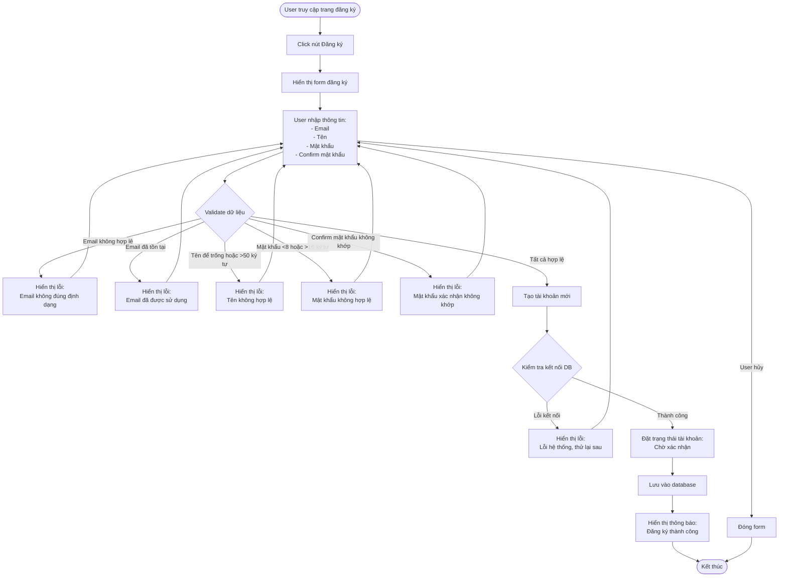

# 2.1.1 Đăng Ký - User Registration Flow

## Mô tả
Tính năng cho phép người dùng đăng ký tài khoản mới trong hệ thống.

**Actor:** Mọi người  
**Mã số:** 2.1.1

## Flowchart

## Validation Rules

- **Email:** Định dạng email hợp lệ, không được trùng với email đã tồn tại
- **Tên:** Không được để trống, tối đa 50 ký tự
- **Mật khẩu:** Không được để trống, tối thiểu 8 ký tự, tối đa 16 ký tự
- **Confirm mật khẩu:** Không được để trống, phải trùng với mật khẩu

## Trạng thái tài khoản sau đăng ký

- Tài khoản được tạo với trạng thái: **"Chờ xác nhận"**

