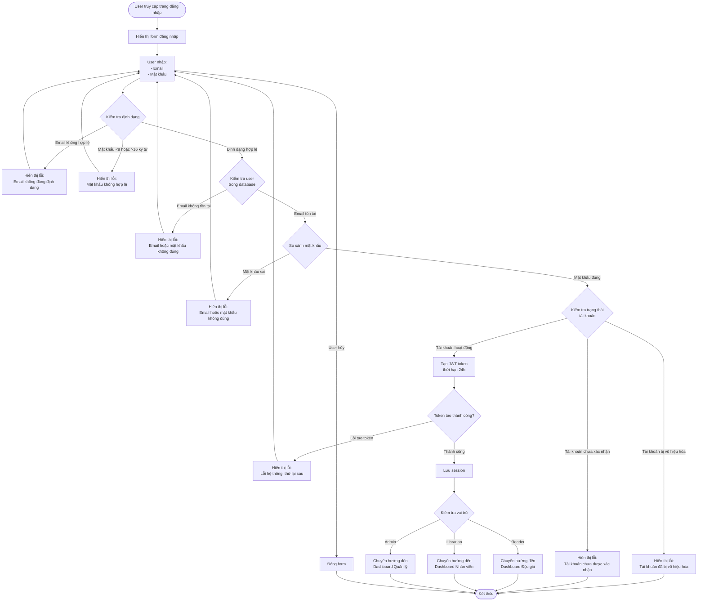

# 2.1.2 Đăng Nhập - User Login Flow

## Mô tả
Tính năng cho phép người dùng đăng nhập vào hệ thống bằng email và mật khẩu.

**Actor:** Mọi người  
**Mã số:** 2.1.2

## Flowchart

## Validation Rules

- **Email:** Định dạng email hợp lệ
- **Mật khẩu:** Không được để trống, tối thiểu 8 ký tự, tối đa 16 ký tự

## Session Management

- JWT token được tạo với thời hạn: **24 giờ**
- Token được lưu trong session/cookie để xác thực các request tiếp theo

## Redirect Logic

Sau khi đăng nhập thành công, user được chuyển hướng đến dashboard tương ứng với vai trò:
- **Reader** → Dashboard Độc giả
- **Librarian** → Dashboard Nhân viên thư viện
- **Admin** → Dashboard Quản lý viên

