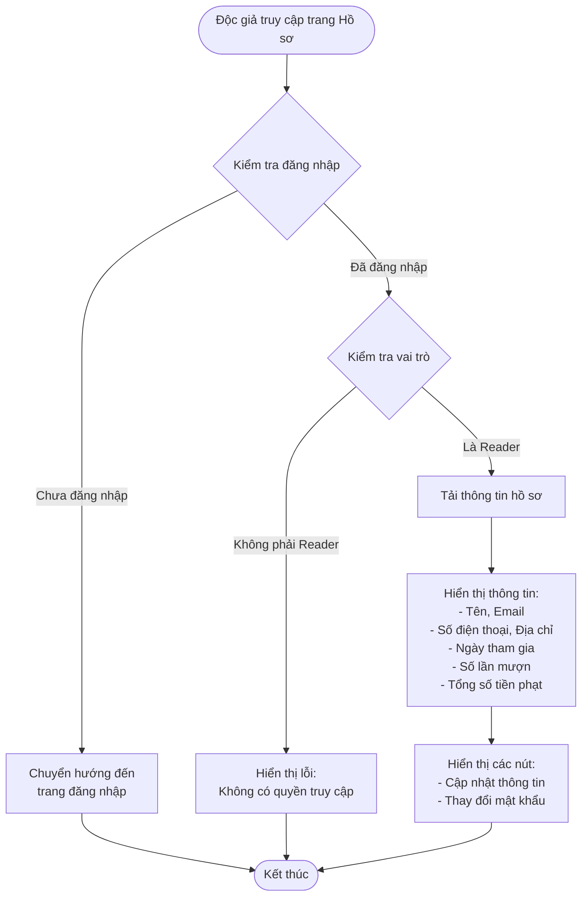
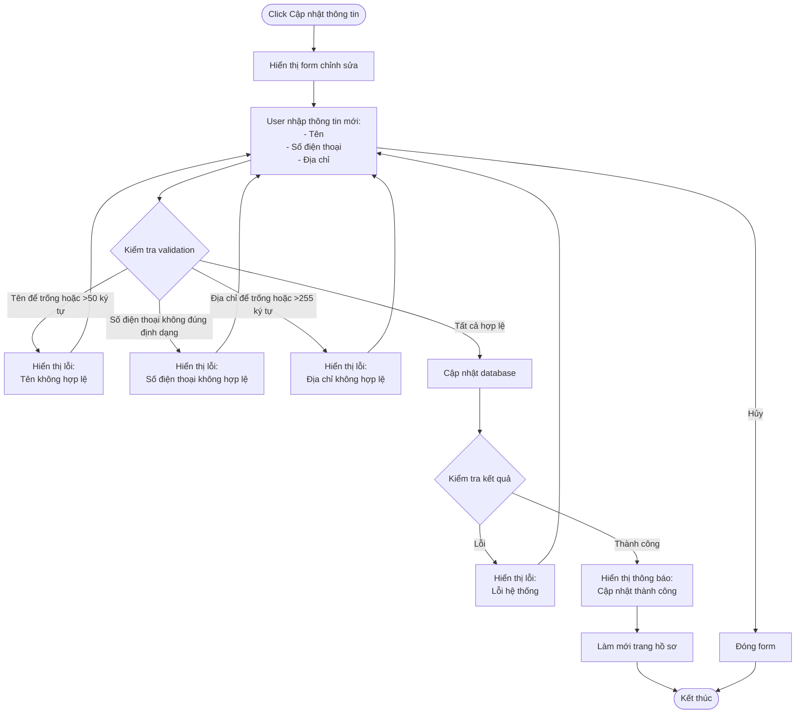
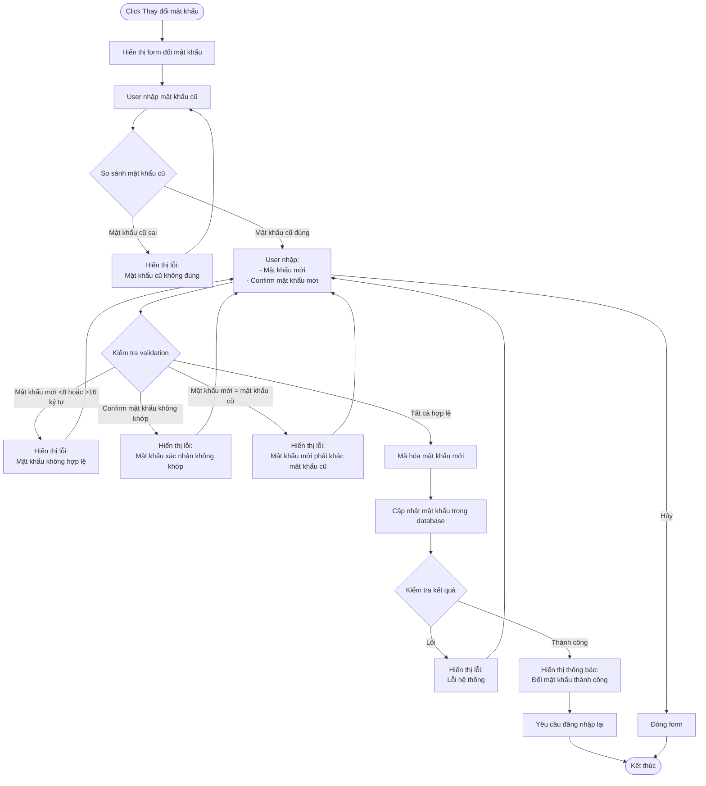

# 2.1.3 Hồ Sơ Cá Nhân - User Profile Flow

## Mô tả
Tính năng cho phép độc giả xem và cập nhật thông tin cá nhân, thay đổi mật khẩu.

**Actor:** Độc giả  
**Mã số:** 2.1.3  
**Yêu cầu:** Đăng nhập với vai trò độc giả

## Flowchart - Xem Hồ Sơ

## Flowchart - Cập Nhật Thông Tin

## Flowchart - Thay Đổi Mật Khẩu

## Validation Rules

- **Tên:** Không được để trống, tối đa 50 ký tự
- **Số điện thoại:** Định dạng số điện thoại hợp lệ
- **Địa chỉ:** Không được để trống, tối đa 255 ký tự
- **Mật khẩu mới:** Tối thiểu 8 ký tự, tối đa 16 ký tự, phải khác mật khẩu cũ

## Thông Tin Hiển Thị

- Tên, Email, Số điện thoại, Địa chỉ
- Ngày tham gia
- Số lần mượn
- Tổng số tiền phạt

