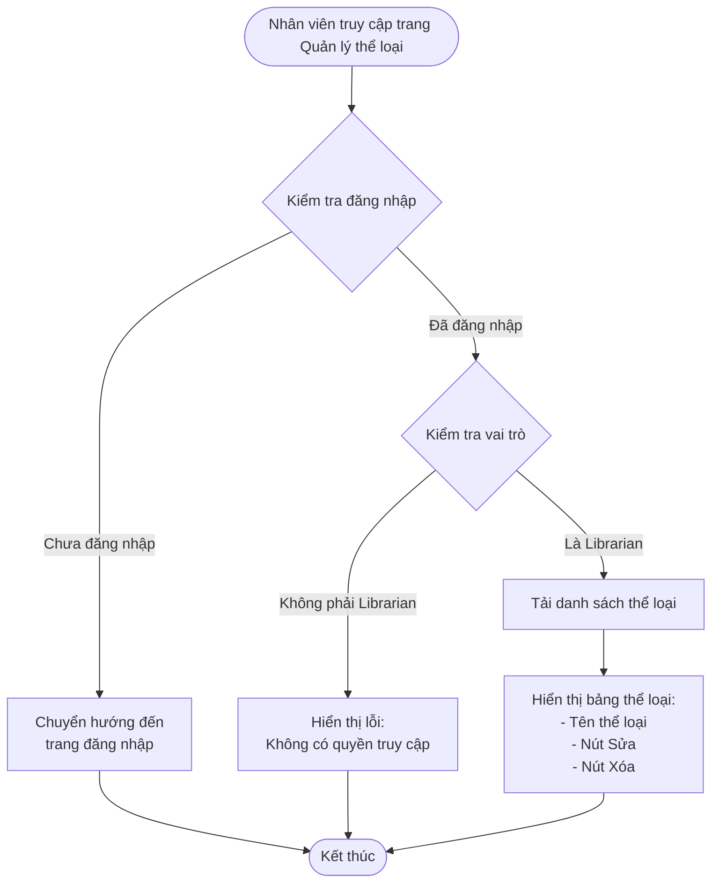
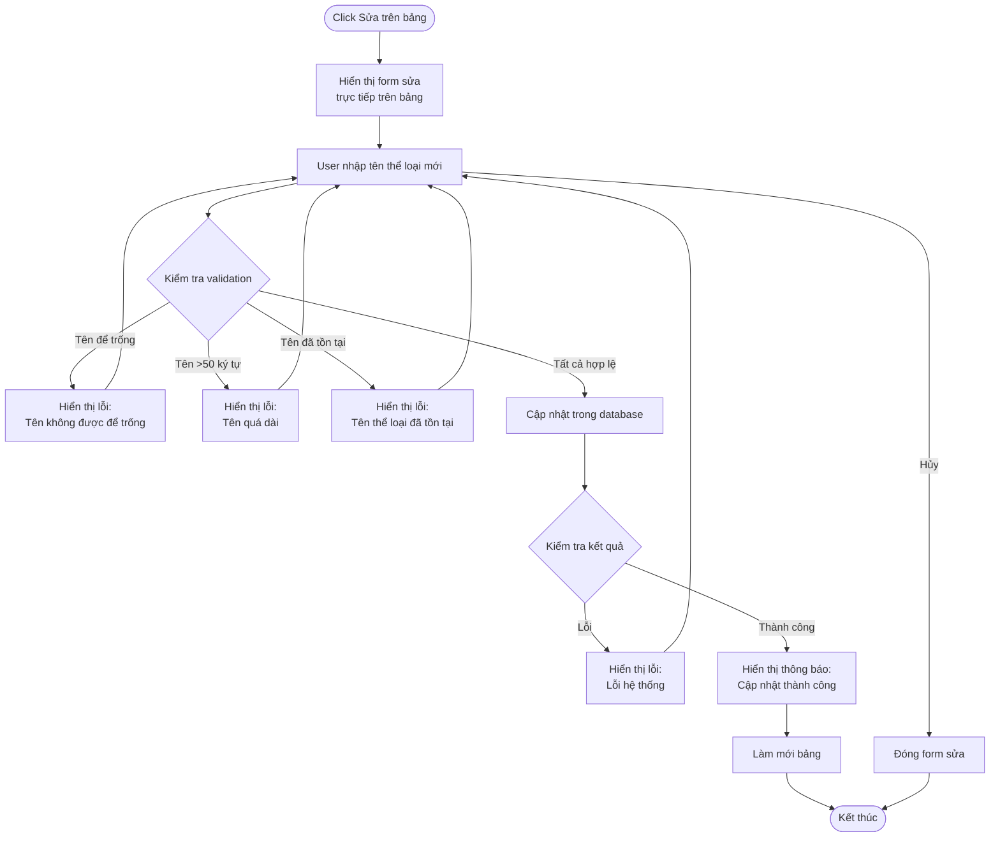
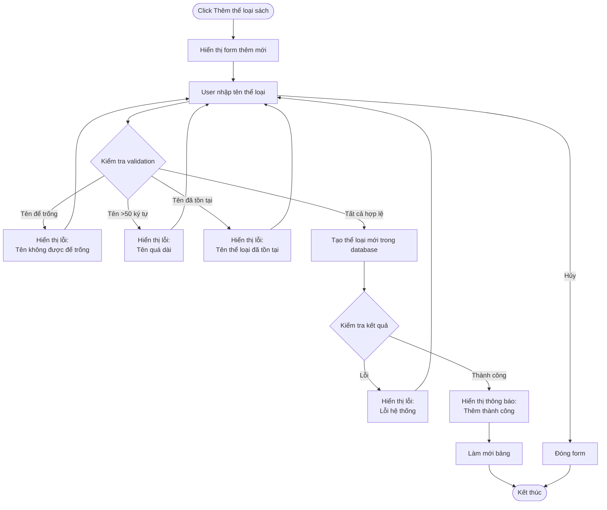
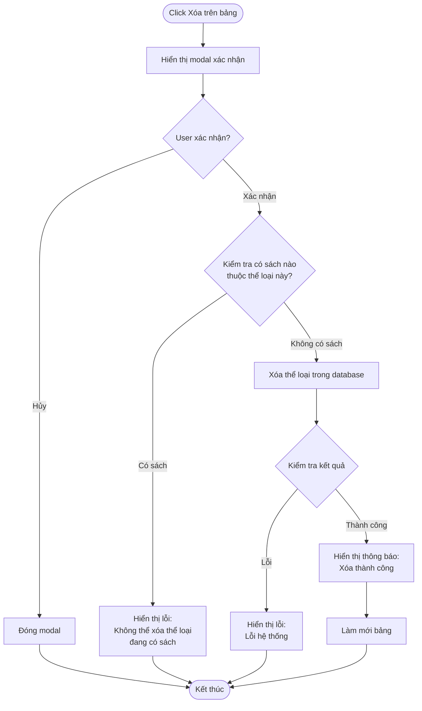

# 2.2.1 Quản lý thể loại sách - Book Category Management Flow

## Mô tả
Tính năng cho phép nhân viên thư viện quản lý các thể loại sách: xem, sửa, thêm mới, xóa.

**Actor:** Nhân viên thư viện  
**Mã số:** 2.2.1  
**Yêu cầu:** Đăng nhập với vai trò nhân viên thư viện

## Flowchart - Xem Danh Sách Thể Loại

## Flowchart - Sửa Thể Loại

## Flowchart - Thêm Thể Loại Mới

## Flowchart - Xóa Thể Loại

## Validation Rules

- **Tên thể loại:** Không được để trống, tối đa 50 ký tự
- **Tên thể loại:** Không được trùng với tên thể loại đã tồn tại

## Điều Kiện Xóa

- Chỉ có thể xóa thể loại khi **không có sách nào** thuộc thể loại đó
- Phải xác nhận trước khi xóa

