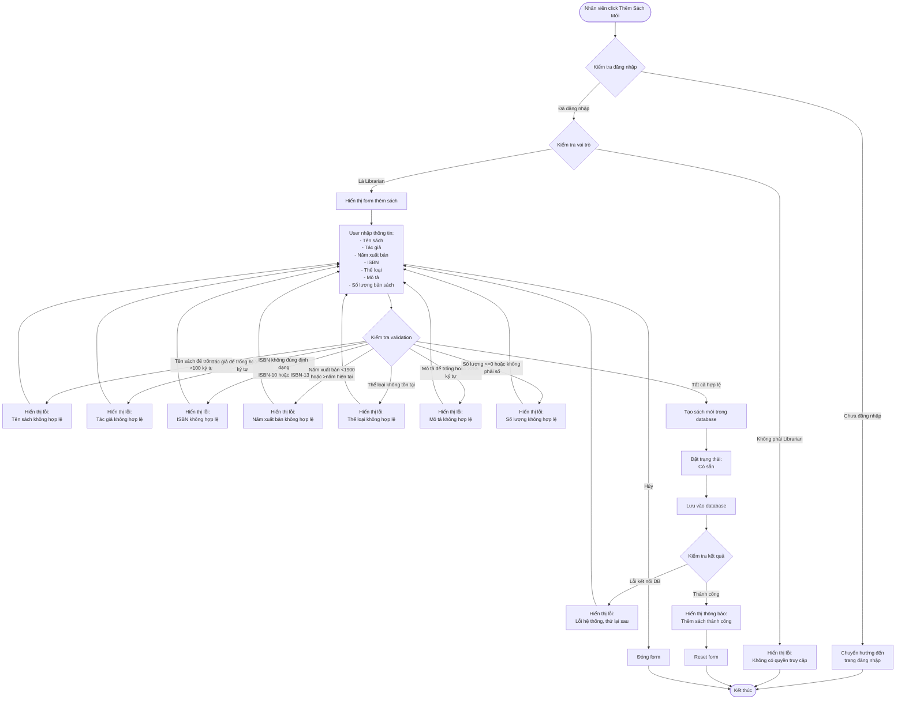

# 2.2.2 Thêm Sách Mới - Add New Book Flow

## Mô tả
Tính năng cho phép nhân viên thư viện thêm sách mới vào hệ thống.

**Actor:** Nhân viên thư viện  
**Mã số:** 2.2.2  
**Yêu cầu:** Đăng nhập với vai trò nhân viên thư viện

## Flowchart

## Validation Rules

- **Tên sách:** Không được để trống, tối đa 100 ký tự
- **Tác giả:** Không được để trống, tối đa 100 ký tự
- **ISBN:** Định dạng chuẩn ISBN-10 hoặc ISBN-13 (nếu có)
- **Số lượng:** Phải > 0, kiểu số
- **Năm xuất bản:** Năm hợp lệ (1900 - năm hiện tại)
- **Thể loại:** Phải có thể loại sách (phải tồn tại trong hệ thống)
- **Mô tả:** Không được để trống, tối đa 255 ký tự

## Trạng Thái Sau Khi Thêm

- Sách được tạo với trạng thái: **"Có sẵn"**
- Số lượng sách có sẵn = Số lượng bản sách nhập vào

