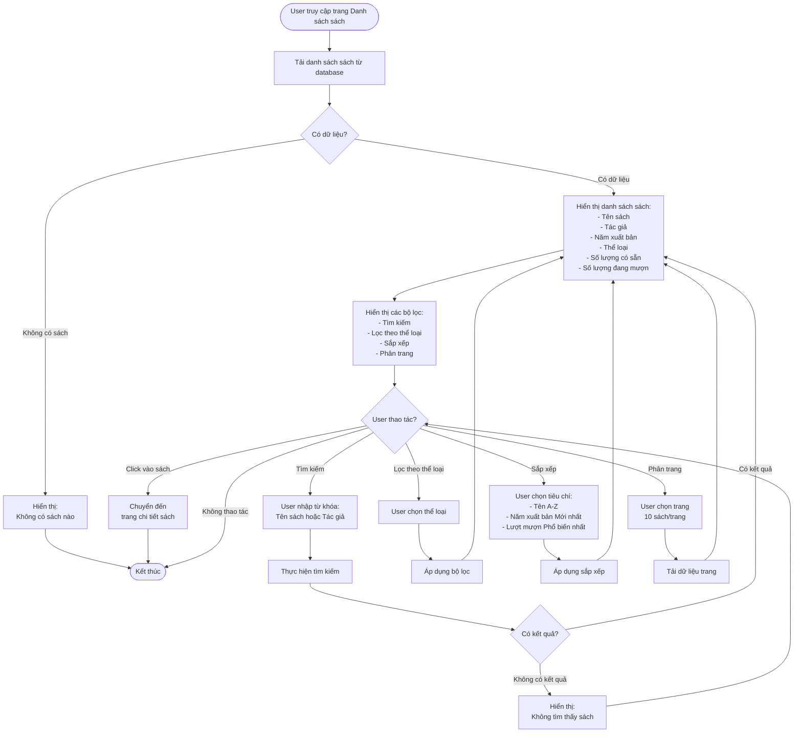

# 2.2.3 Xem Danh Sách Sách - View Book List Flow

## Mô tả
Tính năng cho phép tất cả người dùng (không cần đăng nhập) xem danh sách sách với các chức năng tìm kiếm, lọc, sắp xếp và phân trang.

**Actor:** Tất cả người dùng (không cần login)  
**Mã số:** 2.2.3

## Flowchart

## Thông Tin Hiển Thị

- Tên sách
- Tác giả
- Năm xuất bản
- Thể loại
- Số lượng có sẵn
- Số lượng đang mượn

## Chức Năng Tìm Kiếm & Lọc

### Tìm Kiếm
- Tìm kiếm theo **tên sách** hoặc **tác giả**
- Tìm kiếm không phân biệt hoa thường

### Lọc
- Lọc theo **thể loại sách**

### Sắp xếp
- **Tên (A-Z):** Sắp xếp theo tên sách tăng dần
- **Năm xuất bản (Mới nhất):** Sắp xếp theo năm xuất bản giảm dần
- **Lượt mượn (Phổ biến nhất):** Sắp xếp theo số lượt mượn giảm dần

### Phân Trang
- **10 sách trên 1 trang**
- Hiển thị số trang và nút điều hướng

## Error Cases

- Không có sách nào trong hệ thống
- Kết quả tìm kiếm trống
- Lỗi kết nối database
- Trang không tồn tại (404)

