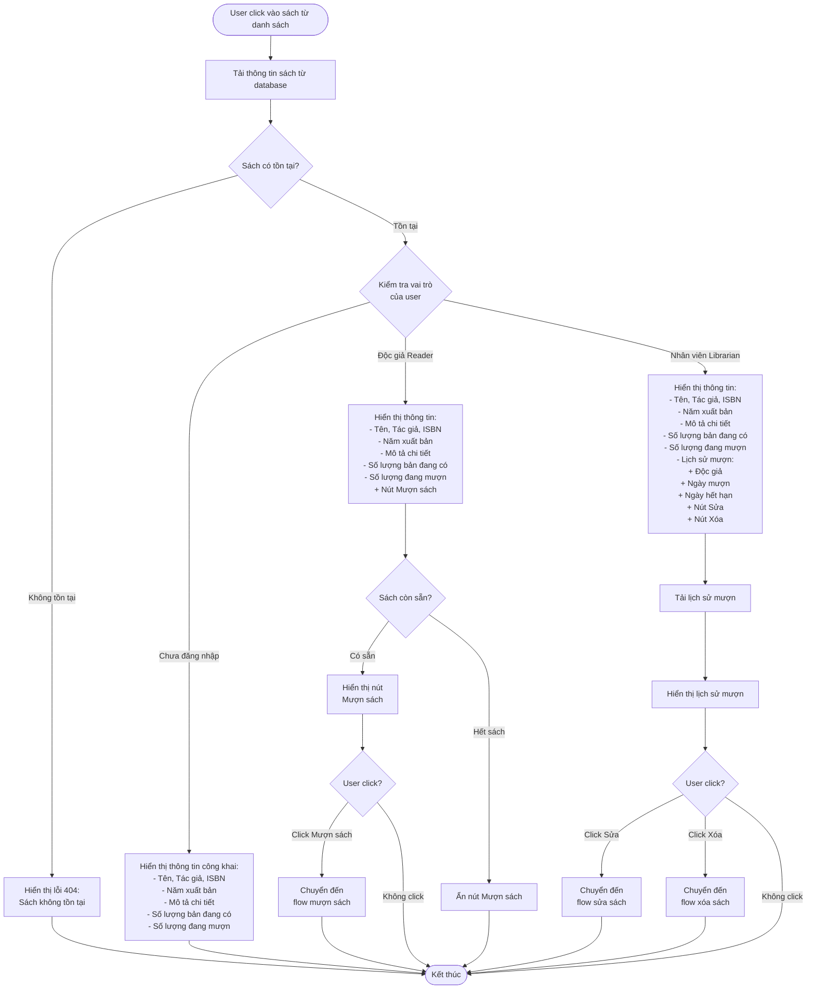

# 2.2.4 Xem Chi Tiết Sách - View Book Detail Flow

## Mô tả
Tính năng cho phép tất cả người dùng (không cần đăng nhập) xem chi tiết thông tin của một cuốn sách.

**Actor:** Tất cả người dùng (không cần login)  
**Mã số:** 2.2.4

## Flowchart

## Thông Tin Hiển Thị

### Tất Cả Người Dùng
- Tên sách
- Tác giả
- ISBN
- Năm xuất bản
- Mô tả chi tiết
- Số lượng bản đang có
- Số lượng đang mượn

### Chỉ Dành Cho Độc Giả (Reader)
- Nút **"Mượn sách"** (chỉ hiển thị khi sách còn sẵn)

### Chỉ Dành Cho Nhân Viên Thư Viện (Librarian)
- **Lịch sử mượn** bao gồm:
  - Độc giả
  - Ngày mượn
  - Ngày hết hạn
- Nút **"Sửa"**
- Nút **"Xóa"**

## Điều Kiện Hiển Thị Nút Mượn Sách

- Chỉ hiển thị cho **độc giả đã đăng nhập**
- Chỉ hiển thị khi **số lượng sách có sẵn > 0**

## Error Cases

- Sách không tồn tại (404)
- Lỗi kết nối database
- Không có quyền xem lịch sử mượn (nếu không phải Librarian)

