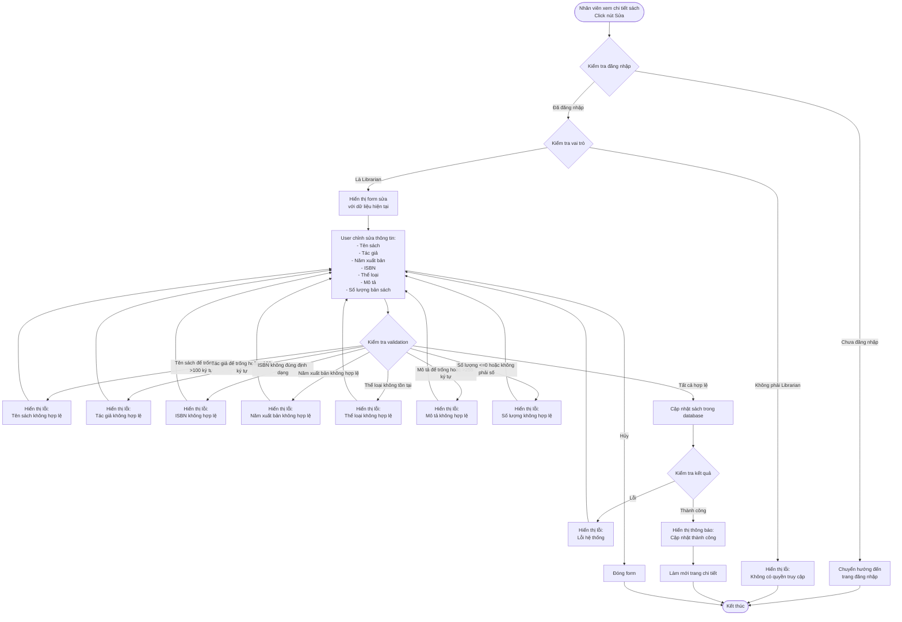
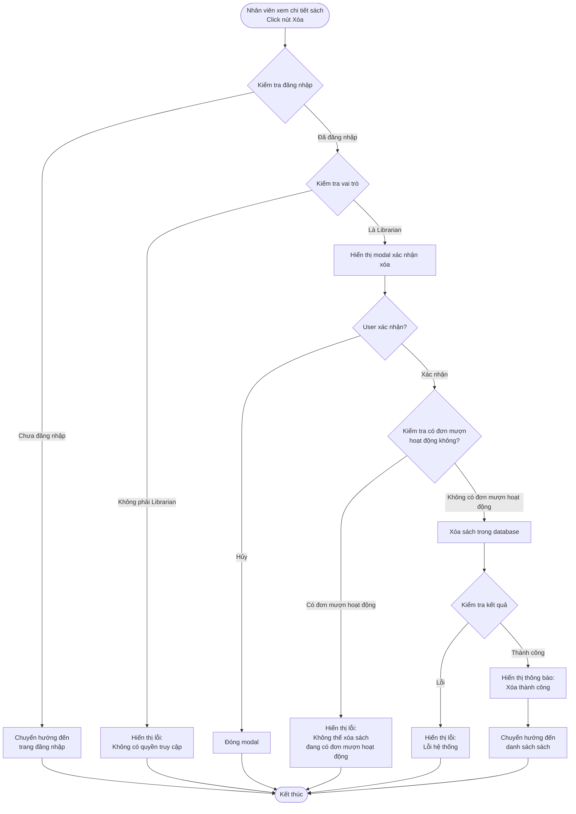

# 2.2.5 Sửa & Xóa Sách - Edit & Delete Book Flow

## Mô tả
Tính năng cho phép nhân viên thư viện sửa và xóa thông tin sách.

**Actor:** Nhân viên thư viện  
**Mã số:** 2.2.5  
**Yêu cầu:** Đăng nhập với vai trò nhân viên thư viện

## Flowchart - Sửa Sách

## Flowchart - Xóa Sách

## Validation Rules (Giống như Thêm Sách)

- **Tên sách:** Không được để trống, tối đa 100 ký tự
- **Tác giả:** Không được để trống, tối đa 100 ký tự
- **ISBN:** Định dạng chuẩn ISBN-10 hoặc ISBN-13 (nếu có)
- **Số lượng:** Phải > 0, kiểu số
- **Năm xuất bản:** Năm hợp lệ (1900 - năm hiện tại)
- **Thể loại:** Phải có thể loại sách (phải tồn tại trong hệ thống)
- **Mô tả:** Không được để trống, tối đa 255 ký tự

## Điều Kiện Xóa

- Chỉ có thể xóa sách khi **không có đơn mượn hoạt động**
- Phải **xác nhận** trước khi xóa

## Error Cases

- Chưa đăng nhập hoặc không phải Librarian
- Sách không tồn tại
- Validation errors khi sửa
- Xóa sách đang có đơn mượn hoạt động
- Lỗi kết nối database

