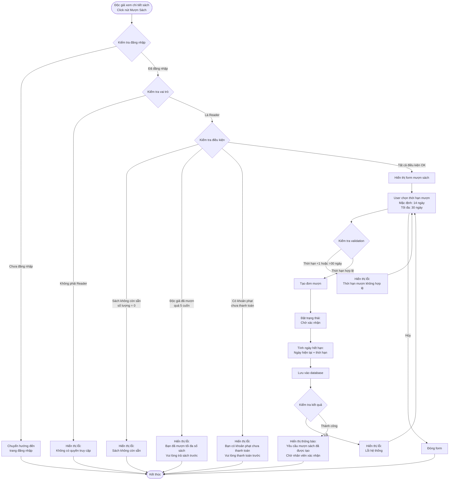

# 2.3.1 Mượn Sách (Độc Giả) - Reader Borrow Book Flow

## Mô tả
Tính năng cho phép độc giả tạo yêu cầu mượn sách.

**Actor:** Độc giả  
**Mã số:** 2.3.1  
**Yêu cầu:** Đăng nhập với vai trò độc giả

## Flowchart

## Điều Kiện Mượn Sách

1. **Sách còn sẵn:** Số lượng sách có sẵn > 0
2. **Không vượt quá giới hạn:** Độc giả chưa mượn quá **5 cuốn sách** (mặc định)
3. **Không có khoản phạt:** Độc giả không có khoản phạt chưa thanh toán

## Thời Hạn Mượn

- **Mặc định:** 14 ngày
- **Tối đa:** 30 ngày
- **Tối thiểu:** 1 ngày

## Trạng Thái Đơn Mượn

- Sau khi tạo, đơn mượn có trạng thái: **"Chờ xác nhận"**
- Đơn mượn sẽ được nhân viên thư viện xác nhận hoặc từ chối (flow 2.3.2)

## Error Cases

- Chưa đăng nhập hoặc không phải Reader
- Sách không còn sẵn
- Đã mượn quá số sách tối đa (5 cuốn)
- Có khoản phạt chưa thanh toán
- Thời hạn mượn không hợp lệ
- Lỗi kết nối database

