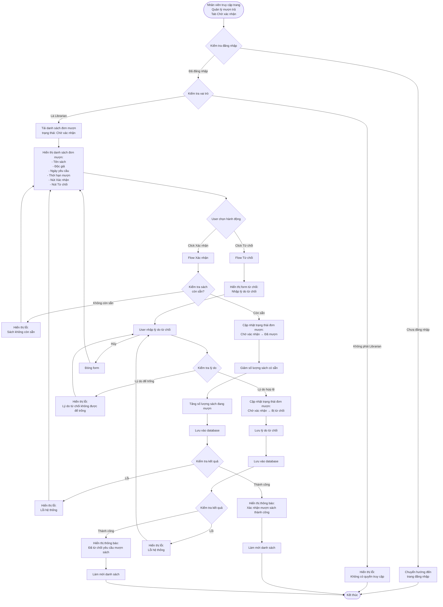

# 2.3.2 Mượn Sách (Nhân Viên Thư Viện) - Librarian Confirm Borrow Flow

## Mô tả
Tính năng cho phép nhân viên thư viện xác nhận hoặc từ chối các yêu cầu mượn sách từ độc giả.

**Actor:** Nhân viên thư viện  
**Mã số:** 2.3.2  
**Yêu cầu:** Đăng nhập với vai trò nhân viên thư viện

## Flowchart

## Trạng Thái Đơn Mượn

### Khi Xác Nhận
- Trạng thái: **"Chờ xác nhận"** → **"Đã mượn"**
- Giảm số lượng sách có sẵn
- Tăng số lượng sách đang mượn

### Khi Từ Chối
- Trạng thái: **"Chờ xác nhận"** → **"Bị từ chối"**
- Lưu lý do từ chối
- Không thay đổi số lượng sách

## Validation Rules

- **Lý do từ chối:** Bắt buộc phải nhập (không được để trống)

## Error Cases

- Chưa đăng nhập hoặc không phải Librarian
- Đơn mượn không tồn tại
- Đơn mượn không ở trạng thái "Chờ xác nhận"
- Sách đã hết khi xác nhận (có thể xảy ra nếu nhiều người cùng mượn)
- Lý do từ chối để trống (khi từ chối)
- Lỗi cập nhật database

