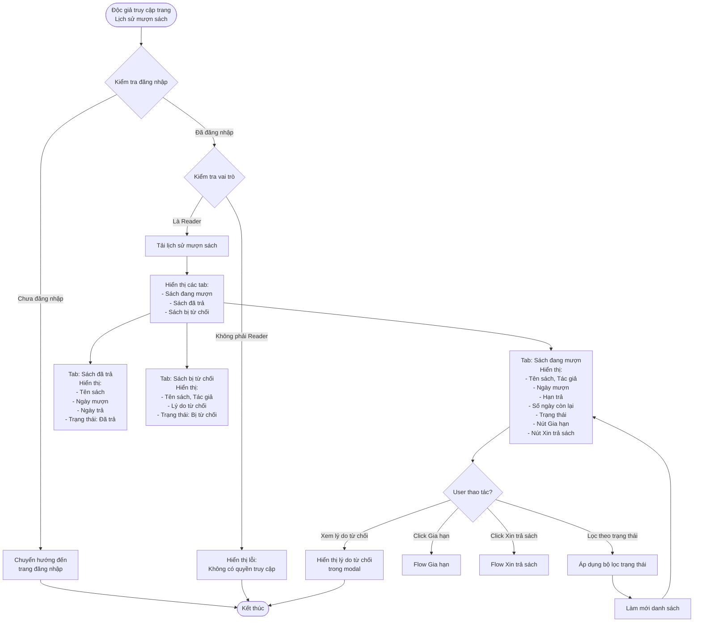
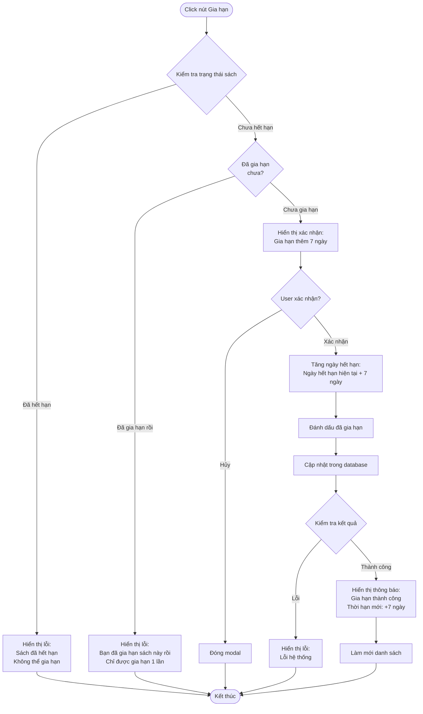

# 2.3.3 Xem Lịch Sử Mượn Sách (Độc Giả) - View Borrow History Flow

## Mô tả
Tính năng cho phép độc giả xem lịch sử mượn sách của mình, bao gồm sách đang mượn, đã trả, bị từ chối, và các chức năng gia hạn, trả sách.

**Actor:** Độc giả  
**Mã số:** 2.3.3  
**Yêu cầu:** Đăng nhập với vai trò độc giả

## Flowchart - Xem Lịch Sử

## Flowchart - Gia Hạn Sách

## Thông Tin Hiển Thị

### Tab: Sách Đang Mượn
- Tên sách
- Tác giả
- Ngày mượn
- Hạn trả
- Số ngày còn lại
- Trạng thái: "Chờ xác nhận", "Đang mượn", "Quá hạn"
- Nút **"Gia hạn"** (nếu chưa hết hạn và chưa gia hạn)
- Nút **"Xin trả sách"** (nếu đang mượn)

### Tab: Sách Đã Trả
- Tên sách
- Ngày mượn
- Ngày trả
- Trạng thái: "Đã trả"

### Tab: Sách Bị Từ Chối
- Tên sách
- Tác giả
- Lý do từ chối
- Trạng thái: "Bị từ chối"

## Chức Năng Gia Hạn

### Điều Kiện
- Sách chưa hết hạn
- Chưa gia hạn lần nào (chỉ được gia hạn **1 lần**)

### Quy Tắc
- Gia hạn thêm **7 ngày** từ ngày hết hạn hiện tại
- Sau khi gia hạn, không thể gia hạn thêm lần nữa

## Chức Năng Lọc

- Lọc theo trạng thái:
  - Chờ xác nhận
  - Đang mượn
  - Quá hạn
  - Đã trả
  - Bị từ chối

## Error Cases

- Chưa đăng nhập hoặc không phải Reader
- Không có lịch sử mượn
- Sách đã hết hạn không thể gia hạn
- Đã gia hạn rồi (chỉ được gia hạn 1 lần)
- Lỗi kết nối database

