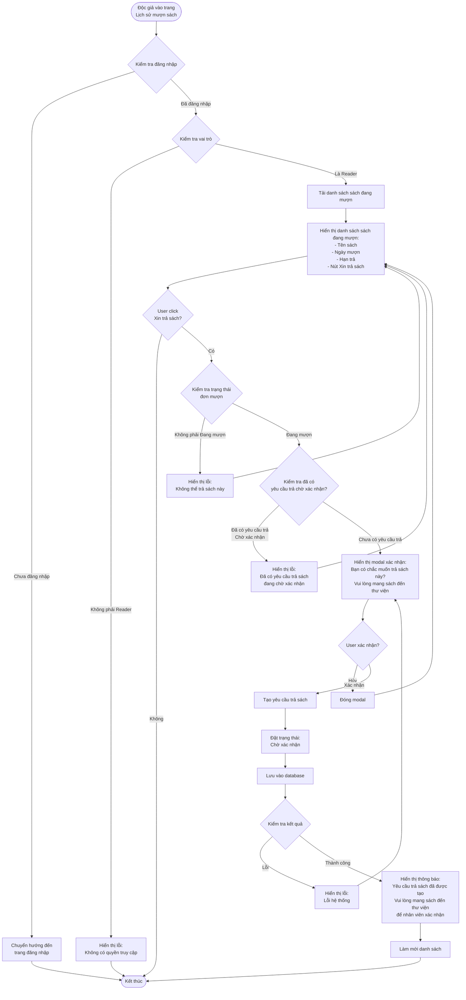

# 2.4.1 Yêu Cầu Trả Sách - Request Return Book Flow

## Mô tả
Tính năng cho phép độc giả tạo yêu cầu trả sách cho các sách đang mượn.

**Actor:** Độc giả  
**Mã số:** 2.4.1  
**Yêu cầu:** Đăng nhập với vai trò độc giả

## Flowchart

## Điều Kiện Tạo Yêu Cầu Trả Sách

1. **Trạng thái đơn mượn:** Phải là **"Đang mượn"**
2. **Không có yêu cầu trả đang chờ:** Một đơn mượn chỉ có thể có **một yêu cầu trả** ở trạng thái "Chờ xác nhận"

## Trạng Thái Yêu Cầu Trả

- Sau khi tạo, yêu cầu trả sách có trạng thái: **"Chờ xác nhận"**
- Yêu cầu sẽ được nhân viên thư viện xác nhận (flow 2.4.2)

## Lưu Ý

- Độc giả cần **mang sách đến thư viện** để nhân viên xác nhận
- Một đơn mượn chỉ có thể tạo **một yêu cầu trả** ở trạng thái "Chờ xác nhận"

## Error Cases

- Chưa đăng nhập hoặc không phải Reader
- Sách không ở trạng thái "Đang mượn"
- Đã có yêu cầu trả sách ở trạng thái "Chờ xác nhận" cho đơn mượn này
- Lỗi kết nối database

