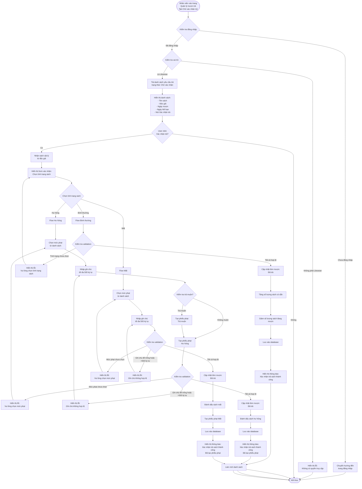

# 2.4.2 Xác Nhận Trả Sách - Confirm Return Book Flow

## Mô tả
Tính năng cho phép nhân viên thư viện xác nhận trả sách và xử lý các trường hợp sách bình thường, hư hỏng, hoặc mất.

**Actor:** Nhân viên thư viện  
**Mã số:** 2.4.2  
**Yêu cầu:** Đăng nhập với vai trò nhân viên thư viện

## Flowchart

## Các Trường Hợp Xử Lý

### 1. Bình Thường
- Chọn tình trạng: **"Bình thường"**
- Cập nhật đơn mượn thành **"Đã trả"**
- Tăng số lượng sách có sẵn
- Giảm số lượng sách đang mượn
- Không tạo phiếu phạt

### 2. Hư Hỏng
- Chọn tình trạng: **"Hư hỏng"**
- **Bắt buộc:** Chọn mức phạt và nhập ghi chú
- Kiểm tra trả muộn:
  - Nếu muộn: Tạo **2 phiếu phạt** (Trả muộn + Hư hỏng)
  - Nếu không muộn: Tạo **1 phiếu phạt** (Hư hỏng)
- Cập nhật đơn mượn thành **"Đã trả"**
- Đánh dấu sách hư hỏng

### 3. Mất
- Chọn tình trạng: **"Mất"**
- **Bắt buộc:** Chọn mức phạt và nhập ghi chú
- Tạo phiếu phạt **"Mất"**
- Cập nhật đơn mượn thành **"Đã trả"**
- Đánh dấu sách mất

## Validation Rules

- **Tình trạng sách:** Bắt buộc chọn (bình thường, hư hỏng, mất)
- **Mức phạt:** Bắt buộc khi tình trạng là "hư hỏng", trả muộn hoặc "mất"
- **Ghi chú:** Bắt buộc khi tình trạng là "hư hỏng" hoặc "mất", tối đa 500 ký tự

## Chọn Mức Phạt

- Khi sách hư hỏng hoặc mất, nhân viên phải chọn một **mức phạt** từ danh sách các mức phạt đã được quản lý viên cấu hình (flow 2.5.1)

## Error Cases

- Chưa đăng nhập hoặc không phải Librarian
- Yêu cầu trả sách không tồn tại
- Yêu cầu không ở trạng thái "Chờ xác nhận"
- Tình trạng sách chưa được chọn
- Mức phạt chưa được chọn (khi hư hỏng hoặc mất)
- Ghi chú để trống hoặc quá dài (>500 ký tự) (khi hư hỏng hoặc mất)
- Mức phạt không tồn tại
- Lỗi tạo phiếu phạt
- Lỗi cập nhật database

