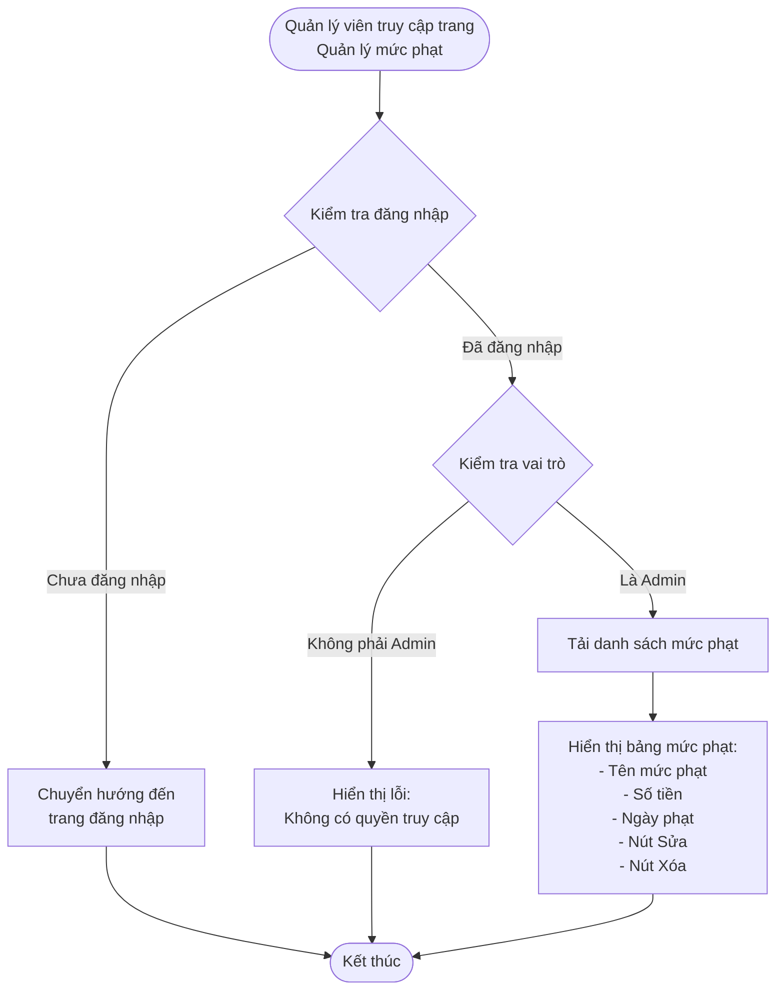
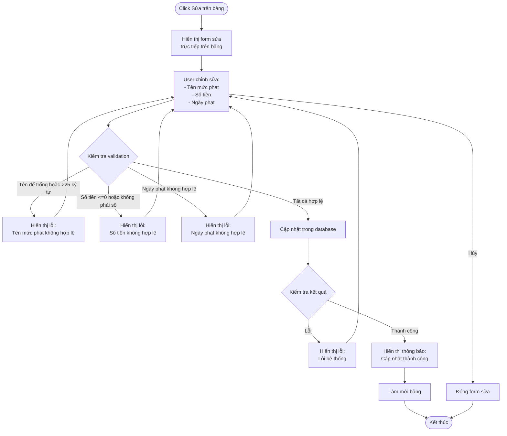
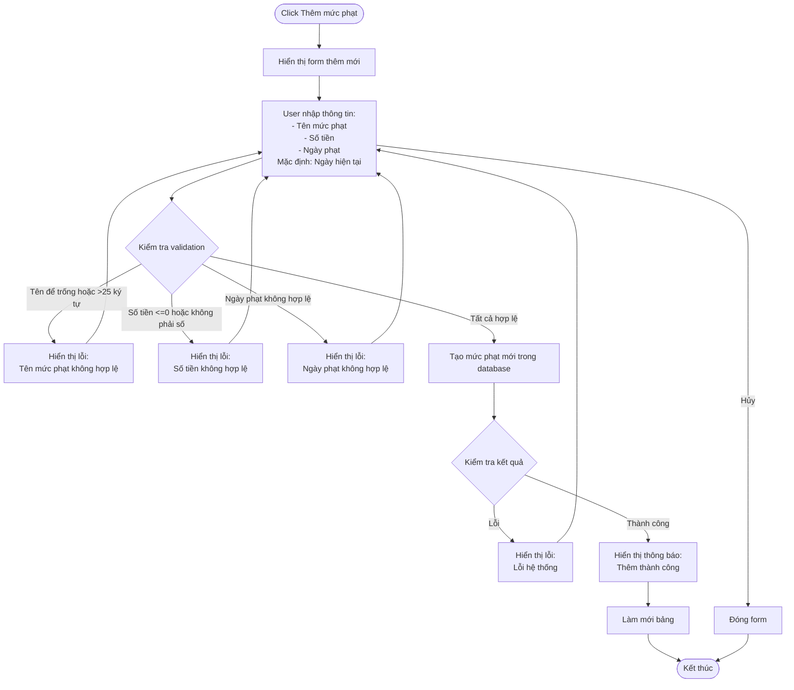
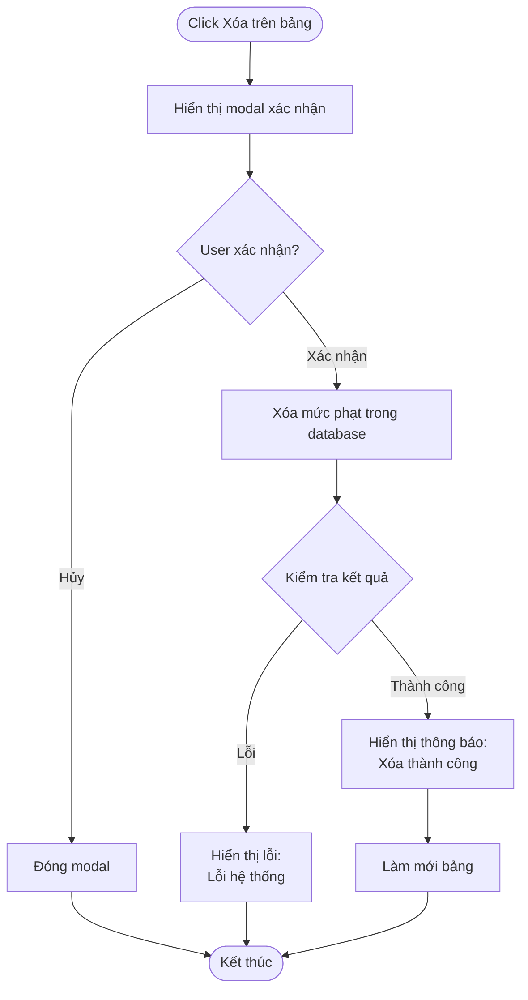

# 2.5.1 Quản lý mức phạt - Penalty Level Management Flow

## Mô tả
Tính năng cho phép quản lý viên quản lý các mức phạt trong hệ thống: xem, sửa, thêm mới, xóa.

**Actor:** Quản lý viên  
**Mã số:** 2.5.1  
**Yêu cầu:** Đăng nhập với vai trò quản lý viên

## Flowchart - Xem Danh Sách Mức Phạt

## Flowchart - Sửa Mức Phạt

## Flowchart - Thêm Mức Phạt Mới

## Flowchart - Xóa Mức Phạt

## Validation Rules

- **Tên mức phạt:** Không được để trống, tối đa 25 ký tự
- **Số tiền:** Phải > 0, kiểu số
- **Ngày phạt:** Ngày hợp lệ (mặc định là ngày hiện tại)

## Thông Tin Mức Phạt

- **Tên mức phạt:** Ví dụ: "Phạt trả muộn", "Phạt hư hỏng nhẹ", "Phạt mất sách"
- **Số tiền:** Số tiền phạt (VNĐ)
- **Ngày phạt:** Ngày áp dụng mức phạt (mặc định: ngày hiện tại)

## Lưu Ý

- Mức phạt được sử dụng khi nhân viên xác nhận trả sách với tình trạng hư hỏng hoặc mất (flow 2.4.2)
- Có thể có nhiều mức phạt khác nhau cho các trường hợp khác nhau

## Error Cases

- Chưa đăng nhập hoặc không phải Admin
- Tên mức phạt để trống hoặc quá dài (>25 ký tự)
- Số tiền <= 0 hoặc không phải số
- Ngày phạt không hợp lệ
- Mức phạt đang được sử dụng (có thể không cho xóa)
- Lỗi kết nối database

