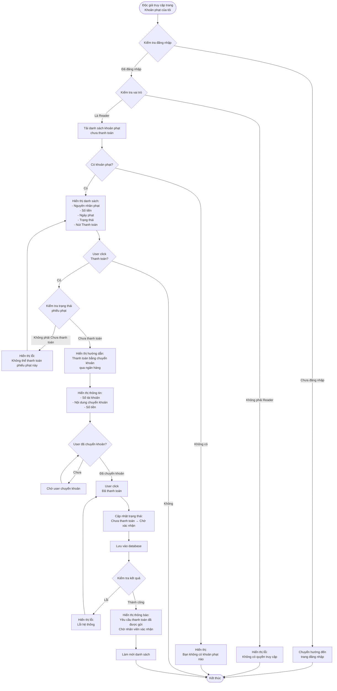

# 2.5.2 Xem & Thanh Toán Khoản Phạt (Độc Giả) - Reader View & Pay Penalty Flow

## Mô tả
Tính năng cho phép độc giả xem và thanh toán các khoản phạt của mình.

**Actor:** Độc giả  
**Mã số:** 2.5.2  
**Yêu cầu:** Đăng nhập với vai trò độc giả

## Flowchart

## Thông Tin Hiển Thị

- **Nguyên nhân phạt:** Ví dụ: "Trả muộn", "Hư hỏng", "Mất sách"
- **Số tiền:** Số tiền phạt (VNĐ)
- **Ngày phạt:** Ngày tạo phiếu phạt
- **Trạng thái:** "Chưa thanh toán", "Chờ xác nhận", "Đã thanh toán", "Từ chối"

## Quy Trình Thanh Toán

1. Độc giả xem danh sách khoản phạt chưa thanh toán
2. Chọn phiếu phạt ở trạng thái **"Chưa thanh toán"**
3. Thanh toán bằng **chuyển khoản qua ngân hàng**
4. Click **"Đã thanh toán"**
5. Phiếu phạt chuyển sang trạng thái **"Chờ xác nhận"**
6. Nhân viên thư viện xác nhận thanh toán (flow 2.5.3)

## Trạng Thái Phiếu Phạt

- **Chưa thanh toán:** Phiếu phạt mới được tạo
- **Chờ xác nhận:** Độc giả đã báo đã thanh toán, chờ nhân viên xác nhận
- **Đã thanh toán:** Nhân viên đã xác nhận thanh toán
- **Từ chối:** Nhân viên từ chối thanh toán (số tiền không phù hợp)

## Error Cases

- Chưa đăng nhập hoặc không phải Reader
- Phiếu phạt không tồn tại
- Phiếu phạt không ở trạng thái "Chưa thanh toán"
- Lỗi cập nhật trạng thái

