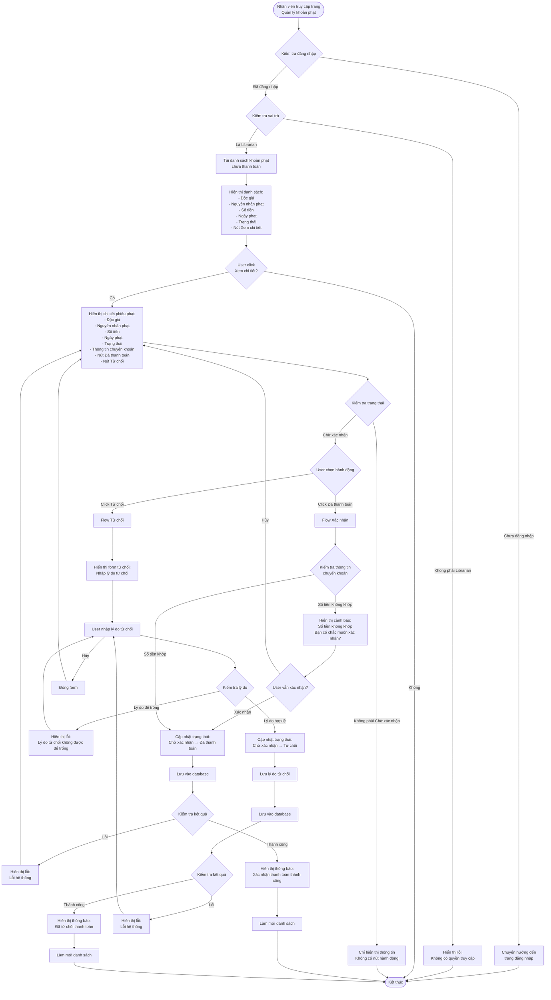

# 2.5.3 Xem & Thanh Toán Khoản Phạt (Nhân Viên Thư Viện) - Librarian Confirm Penalty Payment Flow

## Mô tả
Tính năng cho phép nhân viên thư viện xem và xác nhận/từ chối thanh toán các khoản phạt từ độc giả.

**Actor:** Nhân viên thư viện  
**Mã số:** 2.5.3  
**Yêu cầu:** Đăng nhập với vai trò nhân viên thư viện

## Flowchart

## Trạng Thái Phiếu Phạt

### Khi Xác Nhận
- Trạng thái: **"Chờ xác nhận"** → **"Đã thanh toán"**
- Nhân viên kiểm tra thông tin chuyển khoản và số tiền

### Khi Từ Chối
- Trạng thái: **"Chờ xác nhận"** → **"Từ chối"**
- Lưu lý do từ chối
- Phiếu phạt vẫn ở trạng thái chưa thanh toán

## Validation Rules

- **Lý do từ chối:** Bắt buộc phải nhập (không được để trống)

## Kiểm Tra Thanh Toán

- Nhân viên kiểm tra:
  - Số tiền chuyển khoản có khớp với số tiền phạt không
  - Nội dung chuyển khoản có đúng không
  - Thời gian chuyển khoản

## Error Cases

- Chưa đăng nhập hoặc không phải Librarian
- Phiếu phạt không tồn tại
- Phiếu phạt không ở trạng thái "Chờ xác nhận"
- Lý do từ chối để trống (khi từ chối)
- Lỗi cập nhật database

