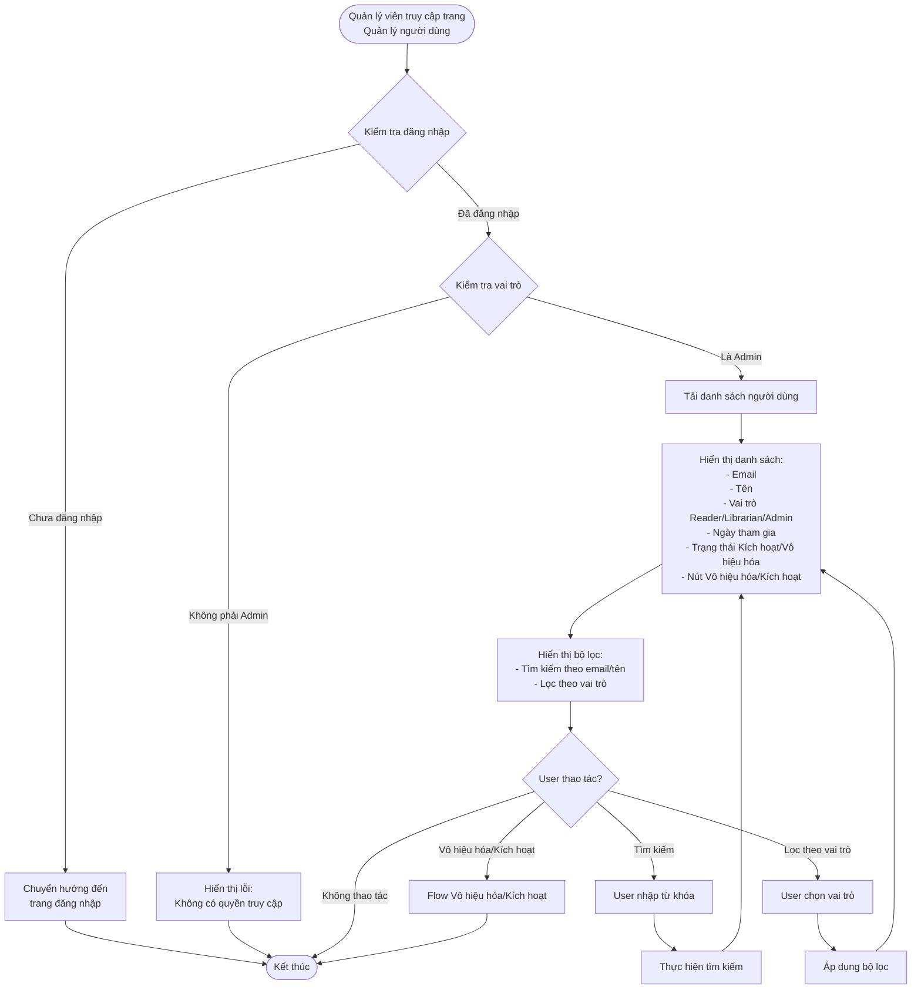
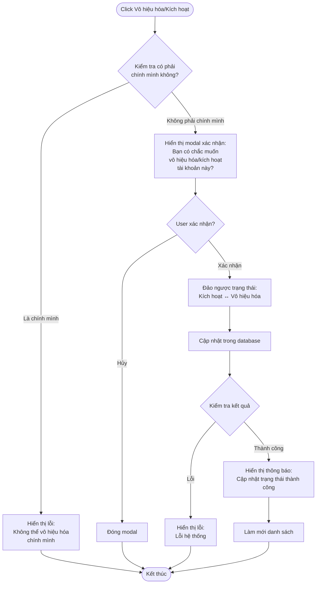

# 2.6.1 Danh Sách Người Dùng - User List Management Flow

## Mô tả
Tính năng cho phép quản lý viên xem danh sách người dùng, tìm kiếm, lọc và quản lý trạng thái tài khoản.

**Actor:** Quản lý viên  
**Mã số:** 2.6.1  
**Yêu cầu:** Đăng nhập với vai trò quản lý viên

## Flowchart - Xem Danh Sách

## Flowchart - Vô Hiệu Hóa/Kích Hoạt Tài Khoản

## Thông Tin Hiển Thị

- **Email:** Email đăng nhập của người dùng
- **Tên:** Tên người dùng
- **Vai trò:** Reader (Độc giả), Librarian (Nhân viên), Admin (Quản lý)
- **Ngày tham gia:** Ngày đăng ký tài khoản
- **Trạng thái:** Kích hoạt / Vô hiệu hóa

## Chức Năng Tìm Kiếm & Lọc

### Tìm Kiếm
- Tìm kiếm theo **email** hoặc **tên**
- Tìm kiếm không phân biệt hoa thường

### Lọc
- Lọc theo **vai trò:** Reader, Librarian, Admin

## Chức Năng Vô Hiệu Hóa/Kích Hoạt

- **Vô hiệu hóa:** Tài khoản không thể đăng nhập
- **Kích hoạt:** Tài khoản có thể đăng nhập bình thường
- **Không thể vô hiệu hóa chính mình**

## Error Cases

- Chưa đăng nhập hoặc không phải Admin
- User không tồn tại
- Không thể vô hiệu hóa chính mình
- Lỗi cập nhật trạng thái

