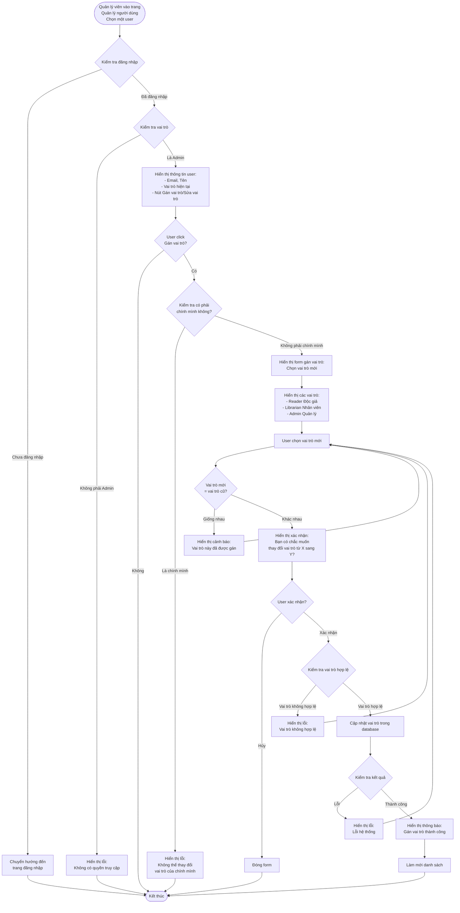

# 2.6.2 Gán Vai Trò - Assign User Role Flow

## Mô tả
Tính năng cho phép quản lý viên gán hoặc thay đổi vai trò của người dùng trong hệ thống.

**Actor:** Quản lý viên  
**Mã số:** 2.6.2  
**Yêu cầu:** Đăng nhập với vai trò quản lý viên

## Flowchart

## Các Vai Trò Trong Hệ Thống

### Reader (Độc giả)
- Chỉ có thể mượn sách, xem lịch sử cá nhân
- Không có quyền quản lý sách hoặc xác nhận mượn/trả

### Librarian (Nhân viên thư viện)
- Có thể quản lý sách, xác nhận mượn/trả
- Theo dõi phạt
- Không có quyền quản lý người dùng hoặc cài đặt hệ thống

### Admin (Quản lý viên)
- Toàn quyền
- Quản lý tài khoản
- Xem báo cáo
- Cài đặt hệ thống

## Quy Tắc Gán Vai Trò

- **Không thể thay đổi vai trò của chính mình**
- Có thể gán bất kỳ vai trò nào cho user khác
- Phải xác nhận trước khi thay đổi vai trò

## Error Cases

- Chưa đăng nhập hoặc không phải Admin
- User không tồn tại
- Vai trò không hợp lệ
- Không thể thay đổi vai trò của chính mình
- Lỗi cập nhật database

