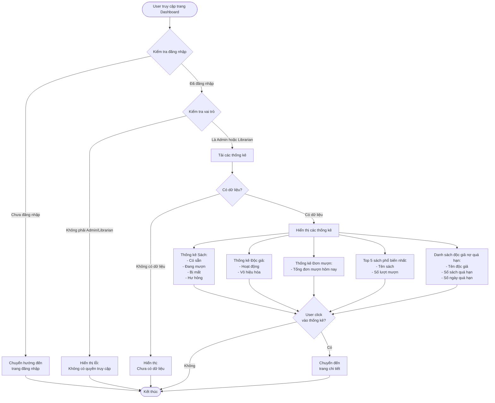

# 2.7.1 Báo Cáo Tổng Quan (Dashboard) - Dashboard Overview Flow

## Mô tả
Tính năng cho phép quản lý viên và nhân viên thư viện xem báo cáo tổng quan về hệ thống.

**Actor:** Quản lý viên, Nhân viên thư viện  
**Mã số:** 2.7.1  
**Yêu cầu:** Đăng nhập với vai trò quản lý viên hoặc nhân viên thư viện

## Flowchart

## Thông Tin Hiển Thị

### 1. Tổng Số Sách
- **Có sẵn:** Số lượng sách đang có sẵn để mượn
- **Đang mượn:** Số lượng sách đang được mượn
- **Bị mất:** Số lượng sách đã bị mất
- **Hư hỏng:** Số lượng sách đã bị hư hỏng

### 2. Tổng Số Độc Giả
- **Hoạt động:** Số độc giả có tài khoản đang hoạt động
- **Vô hiệu hóa:** Số độc giả có tài khoản bị vô hiệu hóa

### 3. Tổng Đơn Mượn Hôm Nay
- Số đơn mượn được tạo trong ngày hôm nay

### 4. Top 5 Sách Phổ Biến Nhất
- Danh sách 5 cuốn sách được mượn nhiều nhất
- Hiển thị: Tên sách, Số lượt mượn

### 5. Danh Sách Độc Giả Nợ Quá Hạn
- Danh sách độc giả có sách mượn quá hạn
- Hiển thị: Tên độc giả, Số sách quá hạn, Số ngày quá hạn

## Tính Năng Tương Tác

- Click vào từng thống kê để xem chi tiết
- Có thể chuyển đến trang báo cáo chi tiết (flow 2.7.2)

## Error Cases

- Chưa đăng nhập hoặc không có quyền (không phải Admin/Librarian)
- Lỗi truy vấn database
- Không có dữ liệu để hiển thị

