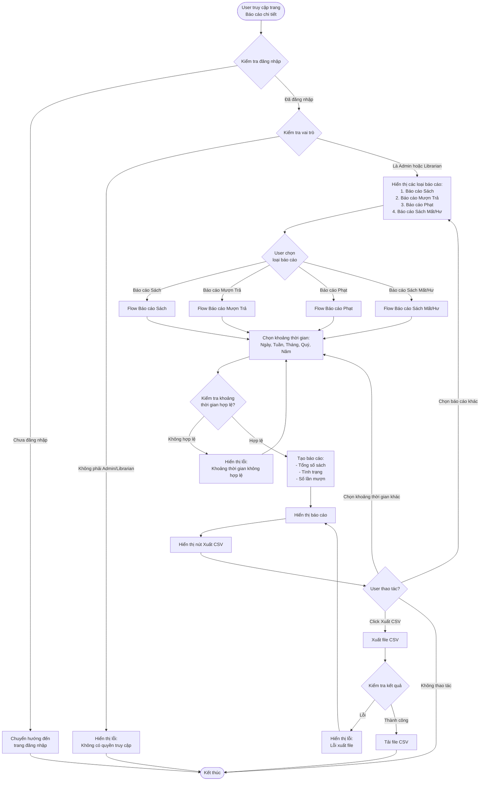

# 2.7.2 Báo Cáo Chi Tiết - Detailed Reports Flow

## Mô tả
Tính năng cho phép quản lý viên và nhân viên thư viện xem các báo cáo chi tiết và xuất ra CSV.

**Actor:** Quản lý viên, Nhân viên thư viện  
**Mã số:** 2.7.2  
**Yêu cầu:** Đăng nhập với vai trò quản lý viên hoặc nhân viên thư viện

## Flowchart

## Các Loại Báo Cáo

### 1. Báo Cáo Sách
**Nội dung:**
- Tổng số sách trong hệ thống
- Tình trạng sách (Có sẵn, Đang mượn, Bị mất, Hư hỏng)
- Số lần mượn của từng sách

### 2. Báo Cáo Mượn Trả
**Nội dung:**
- Số lần mượn theo ngày/tháng/quý
- Số lần trả theo ngày/tháng/quý
- Tỷ lệ mượn/trả

### 3. Báo Cáo Phạt
**Nội dung:**
- Tổng doanh thu phạt
- Số lượng phiếu phạt theo loại (Trả muộn, Hư hỏng, Mất)
- Danh sách người nợ ngoài hạn

### 4. Báo Cáo Sách Mất/Hư
**Nội dung:**
- Danh sách sách cần thay thế
- Số lượng sách mất
- Số lượng sách hư hỏng
- Chi tiết từng sách

## Tính Năng Lọc

### Khoảng Thời Gian
- **Ngày:** Báo cáo theo ngày cụ thể
- **Tuần:** Báo cáo theo tuần
- **Tháng:** Báo cáo theo tháng
- **Quý:** Báo cáo theo quý
- **Năm:** Báo cáo theo năm

## Tính Năng Xuất CSV

- Click nút **"Xuất CSV"** để tải file CSV
- File CSV chứa dữ liệu báo cáo đã được lọc theo khoảng thời gian

## Error Cases

- Chưa đăng nhập hoặc không có quyền
- Khoảng thời gian không hợp lệ
- Không có dữ liệu trong khoảng thời gian đã chọn
- Lỗi truy vấn database
- Lỗi xuất file CSV

