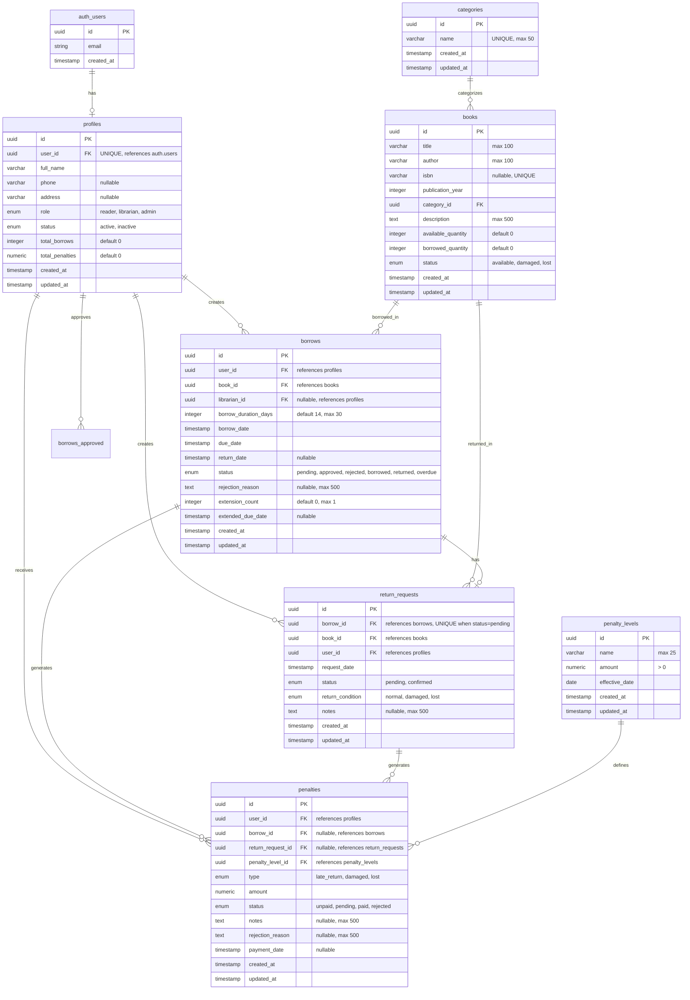

# Database Schema - Library Management System

## Entity-Relationship Diagram

## Indexes

### Primary Indexes (Automatic)
- All tables have UUID primary keys

### Foreign Key Indexes
- `profiles.user_id` (unique index)
- `profiles.id` (for borrows.user_id, return_requests.user_id, penalties.user_id)
- `books.category_id`
- `books.id` (for borrows.book_id, return_requests.book_id)
- `borrows.id` (for return_requests.borrow_id, penalties.borrow_id)
- `borrows.user_id` (for user's borrow history queries)
- `borrows.book_id` (for book's borrow history queries)
- `borrows.status` (for filtering by status)
- `return_requests.borrow_id` (unique partial index for pending status)
- `return_requests.status` (for filtering pending returns)
- `penalties.user_id` (for user's penalty queries)
- `penalties.status` (for filtering unpaid/pending penalties)
- `penalty_levels.id` (for penalties.penalty_level_id)

### Composite Indexes
- `borrows(user_id, status)` - for user's active borrows
- `borrows(book_id, status)` - for book availability checks
- `penalties(user_id, status)` - for user's unpaid penalties
- `books(category_id, status)` - for category filtering
- `books(title, author)` - for search queries

### Unique Constraints
- `profiles.user_id` - one profile per auth user
- `categories.name` - unique category names
- `books.isbn` - unique ISBN (when provided)
- `return_requests(borrow_id)` - partial unique index where status = 'pending'

## Relationships Summary

1. **auth_users → profiles**: One-to-One (via user_id)
2. **profiles → borrows**: One-to-Many (user creates borrows)
3. **profiles → return_requests**: One-to-Many (user creates return requests)
4. **profiles → penalties**: One-to-Many (user receives penalties)
5. **profiles → borrows (as librarian)**: One-to-Many (librarian approves/rejects)
6. **categories → books**: One-to-Many (category has many books)
7. **books → borrows**: One-to-Many (book can be borrowed many times)
8. **books → return_requests**: One-to-Many (book can be returned many times)
9. **borrows → return_requests**: One-to-One (one return request per borrow when pending)
10. **borrows → penalties**: One-to-Many (borrow can generate multiple penalties)
11. **return_requests → penalties**: One-to-Many (return can generate penalties)
12. **penalty_levels → penalties**: One-to-Many (level defines many penalties)

## Business Rules Enforced

1. **User Registration**: New users start with status 'inactive' (pending approval)
2. **Borrow Limits**: Maximum 5 active borrows per user (enforced in application)
3. **Borrow Duration**: Default 14 days, maximum 30 days
4. **Extension**: Maximum 1 extension per borrow (+7 days)
5. **Return Request**: Only one pending return request per borrow
6. **Penalty Types**: late_return, damaged, lost
7. **Penalty Status Flow**: unpaid → pending → paid/rejected

